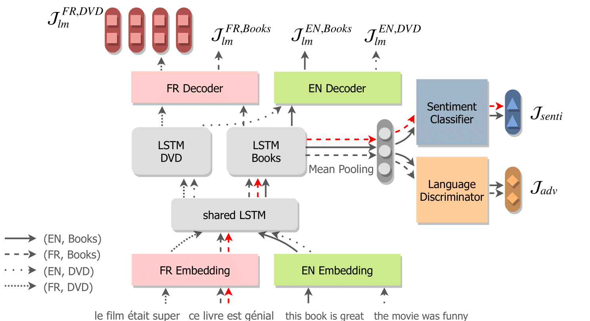

# UXSenti: Unsupervised Cross-lingual Sentiment Analysis

This repository contains models that perform cross-lingual sentiment analysis (CLSA) in a fully unsupervised setting, without target language annotation or cross-lingual supervision. These models rely on language modeling to transfer the sentiment resources from the source language to the target language. We address two different CLSA settings:
- Cross-lingual in-domain (e.g. English book reviews for training and Japanese book review for testing)

- Cross-lingual cross-domain (e.g. English book reviews for training and Japanese music reviews for testing)



Supported languages: English (en) / French (fr) / German (de) / Japanese (ja)

Supported domains: books / dvd / music

## Citation

## Dependencies

- [Python](<https://www.python.org/>) >= 3.6
- [PyTorch](<https://pytorch.org/>) 1.1
- [NLTK](<https://www.nltk.org/>) (for English / French / German tokenization)
- [Mecab](<https://github.com/SamuraiT/mecab-python3>) (for Japanese tokenization)


## Usage

### Download / Preprocess Data

Run the following commands to download the amazon review dataset:

```bash
git clone https://github.com/Evan-Feng/UXSenti.git
cd UXSenti
wget -P data/ http://www.uni-weimar.de/medien/webis/corpora/corpus-webis-cls-10/cls-acl10-unprocessed.tar.gz
tar xvf data/cls-acl10-unprocessed.tar.gz -C data/
```

Then run the following script to preprocess data:

```bash
python preprocess.py
```

This script will:
- Tokenize the data
- Generate vocabularies for all the languages
- Binarize the training / test data

The resulting file structure will look like:

```
.
├── README.md
└── data
    ├── train.pth                (binarized training data)
    ├── test.pth                 (binarized test data)
    ├── tokenized
    │   ├── en.books.unlabeled   (tokenized unlabeled data from the EN-BOOK domain)
    │   ├── en.books.train       (tokenized training data)
    │   ├── en.books.test        (tokenized test data)
    │   └── ...
    └── vocab
        ├── en.vocab             (English vocabulary)
        ├── fr.vocab             (French vocabulary)
        ├── de.vocab             (German vocabulary)
        └── ja.vocab             (Japanese vocabulary)
```

### Run Cross-lingual In-Domain SA

Run the following command to train a CLIDSA_{full} model:

```bash
python cross_lingual_in_domain.py --export export/clid/
```

By default, English is used as the source language and the others are used as target languages (note that using multiple target languages only affects the evaluation). To use a different source language, simple run:

```bash
python cross_lingual_in_domain.py --src fr --trg en de ja --export export/clid2/
```

To run the experiment in a different domain:

```bash
python cross_lingual_in_domain.py --src fr --trg en de ja --sup_dom music --export export/clid3/
```

To run CLIDSA_{min}:

```
python cross_lingual_in_domain.py --lang en fr --src en --trg fr --dom books --sup_dom books --export export/clid4/
```

To run all the CLIDSA experiments (including CLIDSA_{full}, CLIDSA_{min} and MWE):

```bash
bash run_clid.sh
```

### Run Cross-lingual Cross-Domain SA

Run the following command to train a CLCDSA model:

```bash
python cross_lingual_cross_domain.py --export export/clcd/
```

By default the transfer direction is from EN-DVD to DE-Books. To specify a different direction:

```bash
python cross_lingual_cross_domain.py --src fr-music --trg de-books --export export/clcd2/
```

To run all the CLCDSA experiments (including CLCDSA and MWE):

```bash
bash run_clcd.sh
```

## References

